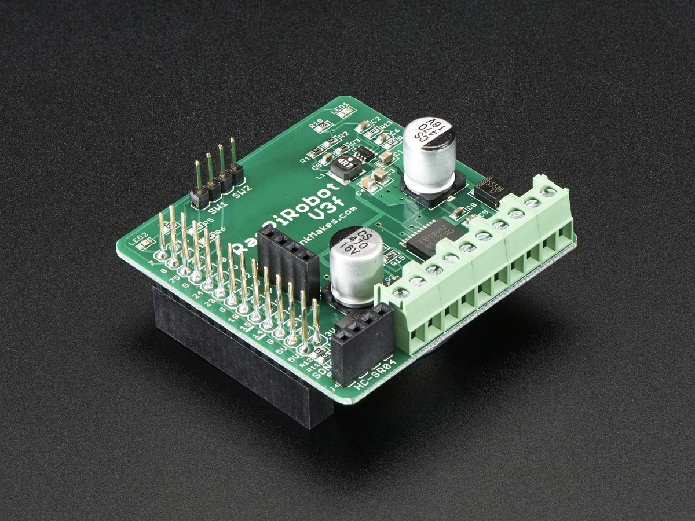
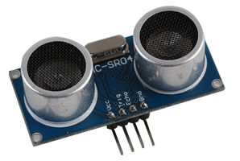

# ESP32 Rover

The ESP-WROOM-32 module was chosen as it was directly supported by the
Micro-ROS project.  The unit I had was bought from
[Amazon](https://smile.amazon.co.uk/gp/product/B071JR9WS9).  There are many
similar products but they have different pin layouts so beware!  There are
several variants of the ESP32 available.  The good news is that most have are
fitted with at least 4MB of Flash, and the rest is all pretty similar.  The
ESP32-CAM modules I have don't have enough GPIO pins for this robot but
might be useful for other projects.

The
[RasPiRobot Rover Robot Kit](https://cpc.farnell.com/monkmakes/sku00049/raspirobot-rover-robot-kit/dp/SC14457)
was chosen as I had it lying around, it was simple and I had all the
documentation.

As part of this kit, there is the RasPiRobot V3f board

and the HC-SR04 sonar unit.

The `resources` directory contains the data sheets used during development of the
drivers.

## Development Setup

The [docker README.md file](docker/README.md) explains how to setup the environment for the rover.

## References

Useful links and the pin out of the
[DOIT ESP32S](https://github.com/playelek/pinout-doit-32devkitv1).

[ESP32 Technical Reference Manual](https://www.espressif.com/sites/default/files/documentation/esp32_technical_reference_manual_en.pdf)

[vfRasPiRobot board schematics](https://github.com/simonmonk/raspirobotboard3).

[Details of the ESP32 board used](https://github.com/Nicholas3388/LuaNode).
